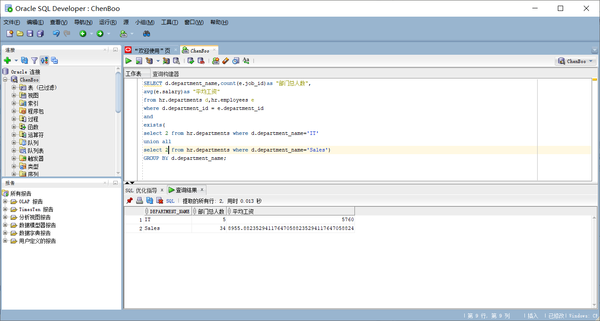

## 实验一：SQL语句的执行计划分析与优化指导

## 1.教材中的查询语句分析

查询结果展示:
---


---

查询1比查询2的sql语句更优！

分析：
>避免使用HAVING子句，HAVING 只会在检索出所有记录之后才对结果集进行过滤。这个处理需要排序,总计等操作。如果能通过WHERE子句限制记录的数目，
>那就能减少这方面的开销。(非 oracle中)on、where、having这三个都可以加条件的子句中，on是最先执行，where次之，having最后，因为on是先把不>符合 条件的记录过滤后才进行统计，它就可以减少中间运算要处理的数据，按理说应该速度是最快的，where也应该比having快点的

- 优化指导：


- 查询1

    >建议：考虑运行可以改进物理方案设计的访问指导或者创建推荐的索引。

    >原理：创建推荐的索引可以显著地改进此语句的执行计划。但是, 使用典型的 SQL 工作量运行 "访问指导" 可能比单个语句更可取。通过这种方法可以获得全面的索引建议案,包括计算索引维护的开销和附加的空间消耗。

- 查询2
>无优化指导

### 自己的查询代码

``` SQL语句
SELECT d.department_name,count(e.job_id)as "部门总人数",
avg(e.salary)as "平均工资"
from hr.departments d,hr.employees e
where d.department_id = e.department_id
and 
exists( 
select 1 from hr.departments where d.department_name='IT'
union all 
select 1 from hr.departments where d.department_name='Sales')
GROUP BY d.department_name;
```

- 查询结果：




- 分析：
>通过使用EXISTS，Oracle会首先检查主查询，然后运行子查询直到它找到第一个匹配项，这就节省了时间。Oracle在执行IN子查询时，首先执行子查询，并>将获得的结果列表存放在一个加了索引的临时表中。在执行子查询之前，系统先将主查询挂起，待子查询执行完毕，存放在临时表中以后再执行主查询。这也>就是使用EXISTS比使用IN通常查询速度快的原因
