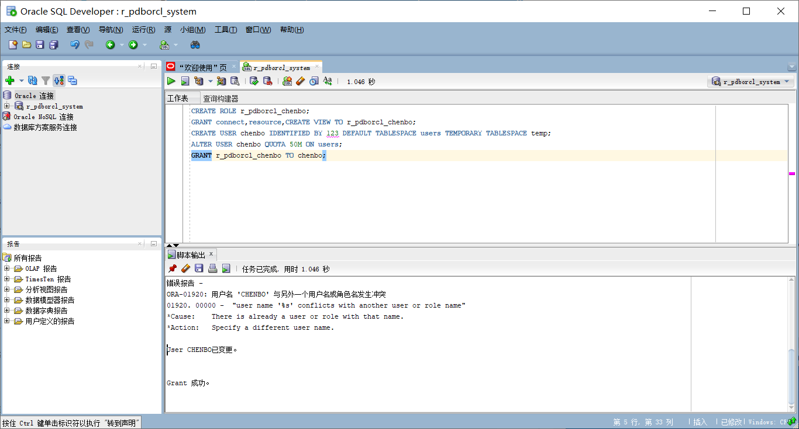
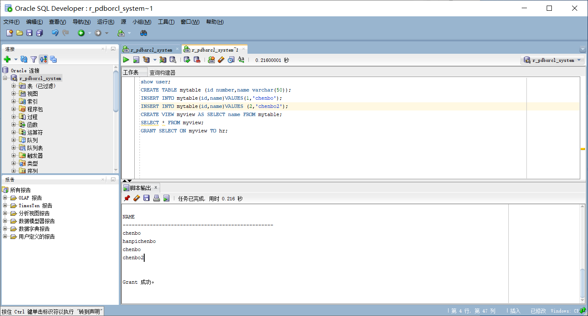
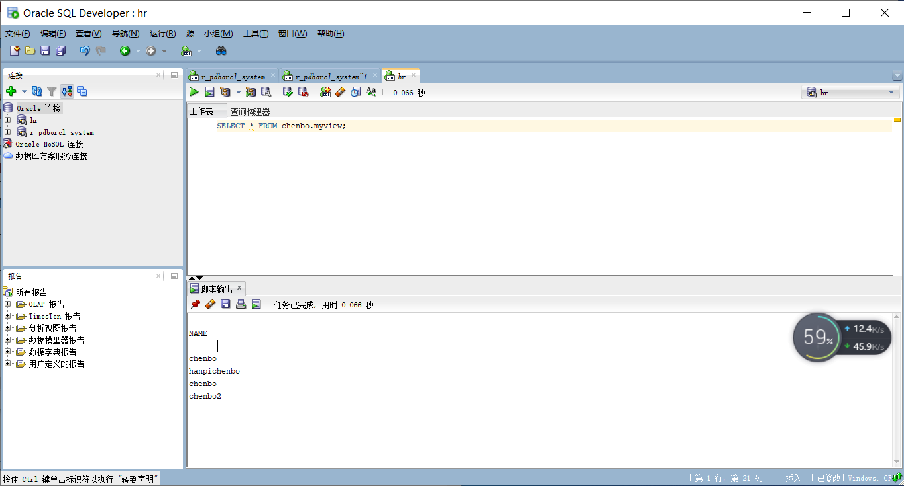

#### 以system登录创建角色
```sql
CREATE ROLE r_pdborcl_chenbo;
GRANT connect,resource,CREATE VIEW TO r_pdborcl_chenbo;
CREATE USER chenbo IDENTIFIED BY 123 DEFAULT TABLESPACE users TEMPORARY TABLESPACE temp;
ALTER USER chenbo QUOTA 50M ON users;
GRANT r_pdborcl_chenbo TO chenbo;
```
实验截图：


#### 新用户连接，创建表和视图
```sql
show user;
CREATE TABLE mytable (id number,name varchar(50));
INSERT INTO mytable(id,name)VALUES(1,'chenbo');
INSERT INTO mytable(id,name)VALUES (2,'chenbo2');
CREATE VIEW myview AS SELECT name FROM mytable;
SELECT * FROM myview;
GRANT SELECT ON myview TO hr;
```
实验截图：


#### 用户hr连接到pdborcl，查询new_user授予它的视图myview

